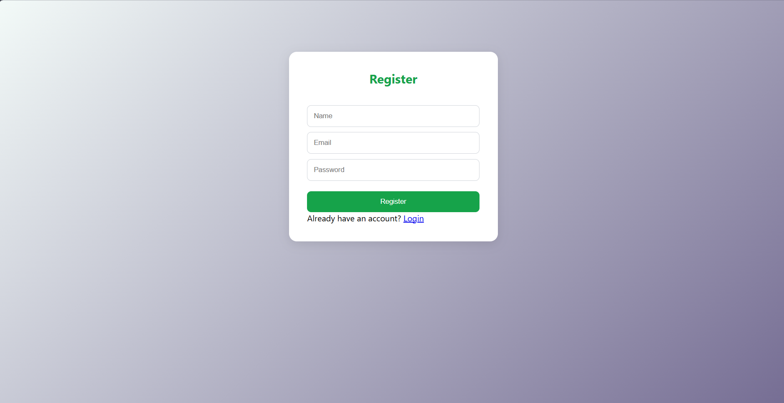

# Task Manager System

## Overview

Task Manager System is a full-stack web application that allows users to register, log in, and manage their daily tasks efficiently.

The application includes user authentication, task creation, editing, status updates, deletion, and search functionality.

## Features

* User Registration
* User Login with JWT Authentication
* Create Tasks
* Edit Tasks
* Update Task Status
* Delete Tasks
* Search Tasks
* Responsive User Interface
* Cloud Database with MongoDB Atlas
* Frontend Deployment on Vercel
* Backend Deployment on Render

## Tech Stack

### Frontend

* React.js
* React Router
* Axios
* CSS

### Backend

* Node.js
* Express.js
* JWT Authentication
* bcryptjs

### Database

* MongoDB Atlas
* Mongoose

## Project Structure

task-manager-system/

├── frontend/

├── backend/

└── README.md

## Installation

### Clone Repository

git clone https://github.com/YOUR_USERNAME/task-manager-system.git

cd task-manager-system

### Backend Setup

cd backend

npm install

npm start

### Frontend Setup

cd frontend

npm install

npm run dev

## Environment Variables

Create a .env file inside the backend folder.

MONGO_URI=your_mongodb_connection_string

JWT_SECRET=your_secret_key

## Live Demo

Frontend: https://task-manager-system-neon.vercel.app/

Backend: https://task-manager-backend-2l2t.onrender.com/

## Screenshots

### Login Page

### Register Page

### Dashboard

## Future Improvements

* User-specific tasks
* Task filtering
* Due dates
* Dashboard statistics
* Dark mode

## Author

Niranjana  Unni
